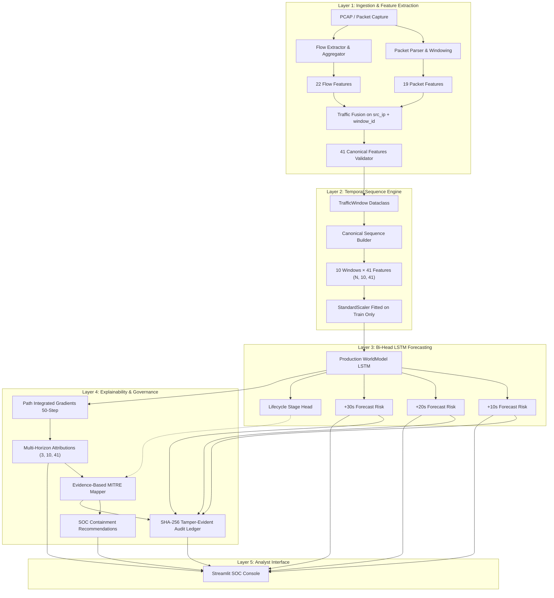

# SIH26153: AI-Based Network Attack Forecasting from Network Traffic Data

> **Scientific Provenance & Evaluation Disclosure:**  
> **Operational Status:** `SYNTHETIC DEMONSTRATION ONLY`  
> **Empirical Validation:** `RAW CSE-CIC-IDS2018 TELEMETRY PENDING EXTRACTION — REAL DATA EXPERIMENT NOT YET EXECUTED`  
> All reported benchmarks, trajectories, and evaluations in this repository demonstrate architectural integrity, fair baseline comparisons, and pipeline mechanics using the canonical integration fixture. They must not be cited as empirical real-world benchmark metrics.

---

## 1. Project Title & Problem Statement

* **Project Title:** AI-Based Network Attack Forecasting from Network Traffic Data
* **Problem Statement Identifier:** `SIH26153` (Smart India Hackathon 2026)
* **Target Domain:** Predictive Cybersecurity, Defensive Telemetry Analytics, and Automated Threat Triage

---

## 2. Project Overview

**SIH26153** is a temporal cybersecurity analytics platform that transitions network defense from reactive intrusion detection to predictive attack forecasting. Rather than flagging events after a breach has occurred, the system ingests streaming network telemetry, normalizes flow and packet signals into canonical 10-second temporal windows, and forecasts future attack probability across three discrete horizons (+10s, +20s, and +30s). The predictions feed an axiomatic feature attribution engine (Path Integrated Gradients), an evidence-based MITRE ATT&CK mapping layer, and a cryptographically chained SHA-256 tamper-evident audit ledger.

---

## 3. Problem Being Addressed

Modern Security Operations Centers (SOCs) face an overwhelming volume of reactive alerts from conventional Intrusion Detection Systems (IDS). By the time a signature matches or an anomaly fires:
* Malicious reconnaissance has already mapped internal subnet perimeters.
* Lateral movement or exfiltration may already be underway.
* Analysts must manually correlate packet captures and NetFlow logs across fragmented consoles.

SIH26153 addresses this operational lag by shifting defense **left of breach**—providing early warnings 10 to 30 seconds into the future based on evolving multi-window temporal traffic dynamics.

---

## 4. Objectives & Intended Users

### Core Objectives
1. **Pre-Emptive Forecasting:** Predict network attack probabilities at +10s, +20s, and +30s horizons from 10 consecutive historical windows (100 seconds total observation).
2. **Multimodal Early Fusion:** Seamlessly combine 22 flow-level statistics (NetFlow/binetflow) and 19 packet-level features (raw PCAP) into a locked 41-feature canonical representation.
3. **Axiomatic Explainability:** Provide exact path-integrated gradients attribution satisfying mathematical completeness without collapsing temporal history.
4. **Actionable Analyst Guidance:** Map observable telemetry evidence to candidate MITRE ATT&CK techniques with defensible confidence scores and SOC containment playbooks.
5. **Accountable Audit Trail:** Cryptographically hash-chain every forecasting decision and evidence summary into a local tamper-evident SHA-256 ledger.

### Intended Users
* **Tier-1/Tier-2 SOC Analysts:** Triage hosts exhibiting accelerating forward attack trajectories.
* **Incident Responders:** Execute pre-emptive containment playbooks before complete socket exhaustion or exfiltration.
* **Security Data Scientists:** Benchmark temporal deep learning against rigorous flattened baselines with chronological split guarantees.

---

## 5. What the AI Does and Does Not Do

### What the System Does
* Consumes sequences of 10 discrete 10-second windows ($10 \times 41$ numerical matrices) per source host.
* Jointly outputs continuous future attack risk probabilities for +10s, +20s, and +30s.
* Predicts an auxiliary cyber lifecycle stage (Benign, Reconnaissance, Exploitation, Action on Objectives).
* Computes feature attributions across all 3 horizons using 50-step Riemann path integration.
* Evaluates heuristic network evidence rules to recommend candidate MITRE techniques.

### What the System Does NOT Do
* **Does NOT prove an attack occurred:** Forecasts represent probabilistic risk trends, not definitive evidence of a breach.
* **Does NOT replace human judgment:** Playbooks and isolate/block commands are advisory.
* **Does NOT predict future raw feature vectors (Level 2 WorldModel):** The system predicts future scalar risk probabilities and stage classes; it does not hallucinate future raw network packets.
* **Does NOT execute decentralized blockchain consensus:** The audit ledger uses SHA-256 hash chaining on single storage nodes, without peer-to-peer consensus (PoW/PoS/Raft).
* **Does NOT claim zero-shot generalization:** Models have not yet been evaluated on unseen physical network topologies.

---

## 6. System Architecture & End-to-End Data Flow



---

## 7. Layer 1: Traffic Ingestion, Packet/Flow Processing, and Fusion

The ingestion layer normalizes high-rate network traffic into discrete, non-overlapping 10-second temporal windows indexed by `(src_ip, window_id)`:

* **Packet Feature Extractor (19 features):**
  Streaming inspection via Scapy `PcapReader` extracting packet volume, TTL distribution (`ttl_mean`, `ttl_std`, `ttl_min`, `ttl_max`), TCP window size dynamics (`tcp_window_mean`, `tcp_window_std`), packet fragmentation, payload size metrics, retransmission heuristics, and port scan distribution metrics (`port_scan_score`, `sequential_port_ratio`, `unique_dst_ports`).
* **Flow Feature Extractor & Aggregator (22 features):**
  5-tuple flow grouping extracting connection frequency (`flow_count`), destination IP breadth (`unique_dst_ip_count`), destination port diversity (`unique_dst_port_count`), total and mean bytes, packet counts, flow durations, inter-arrival times (IAT), protocol ratios (`tcp_flow_ratio`, `udp_flow_ratio`), bidirectional conversation ratios, and TCP flag sums (`syn_count`, `ack_count`, `fin_count`, `rst_count`, `psh_count`, `urg_count`).
* **Fusion Contract:**
  Joins packet and flow tables on `(src_ip, window_id)`. Rejects duplicate host-window rows, detects forbidden identifier/target leakage, produces coverage provenance metrics (`JoinValidationReport`), and asserts full 41-feature completeness in authoritative canonical order.

---

## 8. Layer 2: LSTM Forecasting, Sequence Dimensions, and Horizons

The core production model is a **Bi-Head LSTM WorldModel** implemented in PyTorch:

* **Input Tensor Shape:** `(Batch_Size, 10, 41)` representing 10 consecutive historical windows (100 physical seconds) of 41 z-score normalized features.
* **Architecture:**
  * 2-layer stacked LSTM backbone (Hidden dimension: 64, Dropout: 0.20).
  * Layer Normalization on recurrent hidden states.
  * **Head 1 (Temporal Risk Forecaster):** Multi-horizon linear projection producing continuous logits for $+10\text{s}$, $+20\text{s}$, and $+30\text{s}$, passed through a Sigmoid activation to yield probabilities in $[0.0, 1.0]$.
  * **Head 2 (Auxiliary Lifecycle Classifier):** Linear projection into 4 cyber lifecycle stages (Benign, Reconnaissance, Exploitation, Action on Objectives) trained via Cross-Entropy.
* **Frozen Checkpoint:** Stored in `artifacts/world_model.pt` with embedded canonical schema hash `7dc05760abf2b5e881e51f9bd464f45b89ae35b6ec67af4032a8e6235390e6dd`.

---

## 9. Forecast Outputs & Operational Interpretation

| Horizon | Physical Offset | Operational Role | Recommended SOC Action |
| :--- | :--- | :--- | :--- |
| **$+10\text{s}$** | 10 seconds ahead | Immediate triage | Verify active host socket state; inspect egress flow rate. |
| **$+20\text{s}$** | 20 seconds ahead | Automated rule preparation | Pre-stage firewall rate limits; prepare ACL rule insertion. |
| **$+30\text{s}$** | 30 seconds ahead | Perimeter reconfiguration | Enforce dynamic host isolation or quarantine at border firewall. |

Probabilities are formatted consistently across cards, tables, and charts (`format_probability`), with raw numeric floats retained in parentheses. Non-zero probabilities below 0.05% display as `< 0.1%` to prevent misleading zero-risk assertions.

---

## 10. Explainability: Path Integrated Gradients

Explainability is implemented using **Path Integrated Gradients** (Sundararajan et al., 2017) with pure PyTorch gradients:
* **Attribution Tensor Shapes:**
  * Single horizon attribution: `(10, 41)` preserving temporal historical windows without temporal pooling collapse.
  * Multi-horizon attribution tensor: `(3, 10, 41)` covering $+10\text{s}$, $+20\text{s}$, and $+30\text{s}$.
* **Integration Steps:** Exactly 50 Riemann interpolation steps between a zero baseline $x'$ and the active sequence input $x$.
* **Axiomatic Completeness Verification:**
  $$\sum_{t=1}^{10} \sum_{f=1}^{41} \text{Attribution}(t, f) \approx F(x) - F(x')$$
  The console dynamically computes the absolute and relative completeness error, displaying:  
  `"Numerical completeness check: PASS — relative error is within configured tolerance."`  
  (Tolerance bound: 20% relative error for the 50-step discrete Riemann sum approximation).

---

## 11. Verification & Status of SHAP

* **Inspection Result:** The third-party Python `shap` package is **NOT installed, NOT listed in `requirements.txt`, and NOT executed in the forecasting pipeline**.
* **Role of `src/explain/shap_explain.py`:** This module implements `AttributionExplainer` (with a backward-compatible alias `ShapExplainer = AttributionExplainer`). It is a **translation and natural language formatting layer** that takes pre-computed attribution matrices from Path Integrated Gradients and formats them into SOC analyst bullet points, urgency levels, and direction indicators.
* **Authoritative Attribution Method:** **Path Integrated Gradients** remains the sole established mathematical feature attribution implementation.

---

## 12. Evidence-Based MITRE ATT&CK Mapping vs. Model Stage Prediction

The architecture strictly decouples the neural forecaster from the MITRE interpretation layer:

1. **Model Stage Head (Neural Prediction):** Predicts high-level progression stage (e.g. *Reconnaissance*, *Exploitation*) directly from the hidden LSTM representation.
2. **Evidence-Based MITRE Mapper (Separate Heuristic Engine):** Evaluates observable telemetry thresholds (e.g. `syn_count >= 20`, `unique_dst_ports >= 15`) and top-attributed features to map candidate techniques (e.g., **T1046: Network Service Discovery**, **T1498: Network Denial of Service**).
3. **Decoupled Confidence:** The candidate technique confidence score is computed from evidence heuristics and is strictly decoupled from the model's forward risk probability.

---

## 13. Cryptographic Tamper-Evident Audit Ledger

Stored in `artifacts/audit_ledger.json`, the ledger provides verifiable forensic integrity:
* **Hash Chaining:** Each entry incorporates the SHA-256 digest of the preceding block:
  $$\text{Hash}_n = \text{SHA256}(\text{Host} \parallel \text{Timestamp} \parallel \text{WindowID} \parallel \text{Forecasts} \parallel \text{MITRE} \parallel \text{Hash}_{n-1})$$
* **Tamper Detection:** Tested and verified against block payload alterations, previous-hash tampering, block reordering, deletion, and duplicate insertions (`test_tamper_detection_injected_error`).
* **Governance Scope:** Single-node tamper evidence. It does not constitute or claim a decentralized peer-to-peer blockchain.

---

## 14. Dataset Provenance: Synthetic vs. Real Validation

* **Canonical Integration Dataset:** `data/processed/canonical_features.parquet` (1,440 continuous 10-second windows across 6 hosts, derived from `data/mock/canonical_feature_matrix.csv`).
* **Experimental Status:** **SYNTHETIC DEMONSTRATION ONLY**. Raw CSE-CIC-IDS2018 multi-gigabyte PCAP/NetFlow files have not yet been extracted or evaluated.
* **Leakage Controls Enforced:**
  * Chronological temporal splitting (`train < val < test`) occurs prior to sequence generation.
  * `StandardScaler` is fitted strictly on the training partition and frozen for validation and testing.
  * Source host isolation prevents cross-host sequence contamination.
  * Target and identifier columns (`is_malicious`, `stage`, `src_ip`, `window_id`) are rejected by anti-leakage validators.

---

## 15. Evaluation Methodology, Metrics & Baseline Results

Evaluated on the held-out test split (144 sequences; 22 malicious, 122 benign) using validation-frozen decision thresholds:

| Horizon | Model | Input Dimension | Val Threshold | Test Precision | Test Recall | Test F1 | Test ROC-AUC | Test PR-AUC |
| :--- | :--- | :--- | :--- | :--- | :--- | :--- | :--- | :--- |
| **$+10\text{s}$** | **WorldModel (Bi-Head LSTM)** | $10 \times 41$ sequence | 0.05 | 0.9130 | 0.9545 | 0.9333 | **0.9974** | 0.9854 |
| | Logistic Regression | $410$ features (flattened) | 0.05 | 0.8333 | 0.9091 | 0.8696 | 0.9970 | **0.9857** |
| | Random Forest | $410$ features (flattened) | 0.10 | **0.9167** | **1.0000** | **0.9565** | 0.9944 | 0.9593 |
| | Persistence ($y_{\text{curr}}$ at $t$) | State at $t$ | 0.05 | 0.9091 | 0.9091 | 0.9091 | 0.9463 | 0.8403 |
| **$+20\text{s}$** | **WorldModel (Bi-Head LSTM)** | $10 \times 41$ sequence | 0.90 | **0.9412** | 0.7273 | 0.8205 | 0.9885 | **0.9517** |
| | Logistic Regression | $410$ features (flattened) | 0.05 | 0.8333 | **0.9091** | **0.8696** | **0.9892** | 0.9411 |
| | Random Forest | $410$ features (flattened) | 0.60 | 0.8333 | **0.9091** | **0.8696** | 0.9424 | 0.8301 |
| | Persistence ($y_{\text{curr}}$ at $t$) | State at $t$ | 0.05 | 0.8182 | 0.8182 | 0.8182 | 0.8927 | 0.6972 |
| **$+30\text{s}$** | **WorldModel (Bi-Head LSTM)** | $10 \times 41$ sequence | 0.75 | **0.8947** | 0.7727 | **0.8293** | **0.9881** | **0.9409** |
| | Logistic Regression | $410$ features (flattened) | 0.05 | 0.7500 | **0.8182** | 0.7826 | 0.9817 | 0.8976 |
| | Random Forest | $410$ features (flattened) | 0.85 | 0.8095 | 0.7727 | 0.7907 | 0.9311 | 0.7317 |
| | Persistence ($y_{\text{curr}}$ at $t$) | State at $t$ | 0.05 | 0.7273 | 0.7273 | 0.7273 | 0.8390 | 0.5706 |

*Note: All-negative baseline accuracy is 84.72% due to class imbalance. Random Forest performs well at immediate horizons (+10s), while the WorldModel maintains superior long-range precision and discrimination at +30s.*

---

## 16. Project Directory Structure

```
SIH-2026-INTEGRATION/
├── artifacts/                           # Frozen models, metrics, and metadata
│   ├── world_model.pt                   # Canonical 41-feature trained LSTM checkpoint
│   ├── scaler.pkl                       # StandardScaler fitted on train split only
│   ├── feature_order.json               # Authoritative 41-feature order list
│   ├── stage_classes.json               # 4 auxiliary attack stage names
│   ├── metadata.json                    # Checkpoint metadata and schema hash
│   ├── evaluation_metrics.json          # System & baseline benchmark metrics
│   ├── ablation_results.json            # Modality and history depth ablation results
│   ├── audit_ledger.json                # SHA-256 tamper-evident audit ledger
│   └── mock_prediction.json             # Reference demo prediction payload
├── configs/
│   └── project.yaml                     # Authoritative configuration file
├── data/
│   ├── mock/
│   │   └── canonical_feature_matrix.csv # Raw synthetic multi-host CSV fixture
│   └── processed/
│       └── canonical_features.parquet   # Processed canonical feature matrix
├── docs/                                # Technical specifications and protocols
├── src/
│   ├── audit/
│   │   └── ledger.py                    # SHA-256 hash-chained audit ledger
│   ├── baseline/
│   │   ├── logistic.py                  # 410-feature Logistic Regression baseline
│   │   ├── random_forest.py             # 410-feature Random Forest baseline
│   │   └── persistence.py               # Ground-truth state persistence baseline
│   ├── data/
│   │   ├── chunked_ingestion.py         # Memory-bounded chunk streaming
│   │   └── pcap_pipeline.py             # PCAP to 41-feature pipeline adapter
│   ├── eval/
│   │   ├── evaluate_system.py           # Benchmark evaluation runner
│   │   ├── metrics.py                   # Multi-horizon metric computation
│   │   └── ablation.py                  # Feature & depth ablation experiments
│   ├── explain/
│   │   ├── integrated_gradients.py      # Path Integrated Gradients engine (50 steps)
│   │   └── shap_explain.py              # Attribution translation & SOC text engine
│   ├── features/
│   │   ├── packet_parser.py             # Streaming PCAP packet inspection
│   │   ├── packet_features.py           # 19 packet feature extraction
│   │   ├── packet_windowing.py          # 10s temporal window assignment
│   │   ├── build_packet_features.py     # Aggregated packet feature builder
│   │   ├── flow_features.py             # Flow feature definitions
│   │   └── protocol.py                  # Protocol ID normalization (TCP/UDP/ICMP)
│   ├── flow/
│   │   └── flow_extractor.py            # 22 flow features & host-window aggregator
│   ├── fusion/
│   │   └── traffic_fusion.py            # Multimodal fusion on src_ip + window_id
│   ├── mitre/
│   │   ├── evidence.py                  # Telemetry heuristic extraction
│   │   ├── mapping.py                   # Candidate MITRE technique mapper
│   │   └── recommendations.py           # SOC containment playbook generator
│   ├── schemas/
│   │   ├── features.py                  # Authoritative 41-feature schema & hash
│   │   └── traffic.py                   # TrafficWindow canonical dataclass
│   ├── temporal/
│   │   ├── sequences.py                 # Canonical (N, 10, 41) sequence builder
│   │   └── split.py                     # Chronological train/val/test split
│   ├── config.py                        # Authoritative project validator
│   ├── dashboard.py                     # Streamlit SOC interactive console
│   ├── demo.py                          # Core demonstration runner
│   ├── inference.py                     # Model loader and multi-horizon forecaster
│   ├── model.py                         # PyTorch Bi-Head LSTM WorldModel definition
│   ├── pipeline.py                      # End-to-end CyberForecastPipeline
│   └── train.py                         # Model trainer with AMP & batch fallback
├── tests/                               # Full automated test suite (235 tests)
│   ├── test_pcap_canonical_integration.py # 11 PCAP-to-model integration tests
│   ├── test_aman_integration.py         # 12 packet/flow/fusion tests
│   ├── test_final_acceptance_gates.py   # Acceptance gates & failure injections
│   ├── test_final_integration_verification.py # System integration tests
│   ├── test_architectural_invariants.py # Invariant enforcement tests
│   └── ...                              # Complete modular test coverage
├── RUN_DASHBOARD.bat                    # One-click Windows dashboard launcher
├── requirements.txt                     # Pinned Python dependencies
├── IMPLEMENTATION_STATUS.md             # Subsystem implementation taxonomy
├── SCIENTIFIC_VALIDATION_REPORT.md      # Comprehensive benchmark report
├── DATA_PROVENANCE.md                   # Data lineage and split proof
├── KNOWN_LIMITATIONS.md                 # Explicit technical disclosures
└── REPRODUCIBILITY.md                   # Exact reproduction environment & seed
```

---

## 17. Technologies, Libraries & Tools

* **Core Language:** Python 3.11
* **Deep Learning Framework:** PyTorch (`torch>=2.0.0`) — Bi-Head LSTM, LayerNorm, multi-horizon heads.
* **Classical Machine Learning:** scikit-learn (`scikit-learn>=1.3.0`) — StandardScaler, Logistic Regression, Random Forest, precision-recall curve metrics.
* **Telemetry Data Processing:** pandas (`pandas>=1.5.0`), NumPy (`numpy>=1.24.0`), PyArrow (`pyarrow>=12.0.0`), fastparquet.
* **Packet Inspection:** Scapy (`scapy>=2.5.0`) — streaming PCAP parsing, protocol extraction, flag inspection.
* **Interactive Frontend:** Streamlit (`streamlit>=1.28.0`), Plotly (`plotly>=5.15.0`) — real-time visualization and trajectory exploration.
* **Configuration & Testing:** PyYAML (`pyyaml>=6.0`), pytest (`pytest>=7.0.0`).

---

## 18. Installation Prerequisites

* **Operating System:** Windows 10/11, Linux (Ubuntu 20.04+), or macOS.
* **Python Runtime:** Python 3.10 or 3.11 installed and available on `PATH`.
* **Git:** Git 2.30+ for repository cloning and version control.

---

## 19. Environment Setup Instructions

```bash
# 1. Clone the repository
git clone https://github.com/Aryan-coder-2025/SIH-2026.git
cd SIH-2026-INTEGRATION

# 2. Create a virtual environment
python -m venv venv

# 3. Activate the virtual environment
# Windows (PowerShell):
.\venv\Scripts\Activate.ps1
# Windows (Command Prompt):
.\venv\Scripts\activate.bat
# Linux/macOS:
source venv/bin/activate
```

---

## 20. Dependency Installation

```bash
pip install --upgrade pip
pip install -r requirements.txt
```

---

## 21. Dataset & Artifact Setup

The canonical integration dataset and trained artifacts are already structured in the repository:
* If `data/processed/canonical_features.parquet` is missing, it will automatically reconstruct upon first dashboard run from `src/generate_canonical_fixture.py`.
* To manually reconstruct the fixture:
  ```bash
  python src/generate_canonical_fixture.py
  ```

---

## 22. How to Run the Application & Dashboard

### Option 1: Terminal Command
```bash
python -m streamlit run src/dashboard.py
```
Open your browser at `http://localhost:8501`.

### Option 2: Windows Batch Launcher
Double-click `RUN_DASHBOARD.bat` or run:
```cmd
RUN_DASHBOARD.bat
```

### Option 3: VS Code Debug Launcher
Press `F5` or select **"SIH26153 Dashboard"** from the VS Code Run & Debug menu.

---

## 23. How to Run Training & Evaluation

```bash
# 1. Train the Bi-Head LSTM WorldModel (generates artifacts/world_model.pt)
python src/train.py

# 2. Run Comprehensive System & Baseline Evaluation
python src/eval/evaluate_system.py

# 3. Run Controlled Modality & History Depth Ablation Study
python src/eval/ablation.py
```

---

## 24. How to Run Tests

```bash
# Compile all files to verify syntax
python -m compileall -q .

# Run the complete test suite (235 tests)
python -m pytest -q

# Run specific integration tests
python -m pytest tests/test_pcap_canonical_integration.py -v
```

---

## 25. Configuration & Expected Inputs

Configuration is governed by `configs/project.yaml` and authoritatively validated by `src/config.py`:
* **Temporal Windows:** 10.0 seconds per window (`window_seconds: 10`).
* **Sequence History:** 10 windows (`sequence_length_windows: 10`).
* **Forecast Horizons:** 3 steps (`forecast_horizon_windows: 3`), physical offsets: `[10, 20, 30]`.
* **Primary Key:** `(src_ip, window_id)`.

---

## 26. Basic User Workflow

1. **Launch Dashboard:** Start Streamlit and open `http://localhost:8501`.
2. **Select Host & Scenario:** In the sidebar, select target host `192.168.10.10` and scenario `"Attack Episode (Threat Window)"`.
3. **Execute Analysis:** Click **"Run Forecast & Explain"**.
4. **Inspect Overview:** Review the scenario-scoped *Hosts Requiring Attention* table and observed telemetry windows with physical units.
5. **Analyze Trajectory:** Navigate to **Forecast & Trajectory** to observe $+10\text{s}$, $+20\text{s}$, and $+30\text{s}$ probabilities alongside validation-frozen decision thresholds.
6. **Examine Evidence & Playbooks:** Review top-attributed features in **Evidence & XAI** and recommended containment steps in **MITRE ATT&CK**.

---

## 27. Advanced / Scientific Analytics Workflow

1. **Run PCAP Ingestion:** Use `src/data/pcap_pipeline.py` to ingest raw captures and generate canonical sequences:
   ```python
   from src.data.pcap_pipeline import pcap_to_model_forecast
   result = pcap_to_model_forecast("path/to/capture.pcap")
   print("Predictions:", result["predictions"])
   ```
2. **Axiomatic Attribution Check:** Inspect path integration completeness in `tests/test_explainability.py` or the XAI console tab.
3. **Audit Ledger Verification:** Audit cryptographic block hash integrity:
   ```python
   from src.audit.ledger import AuditLedger
   ledger = AuditLedger.load("artifacts/audit_ledger.json")
   is_valid, reason = ledger.verify_integrity()
   assert is_valid, f"Audit failure: {reason}"
   ```

---

## 28. Known Limitations

1. **Synthetic Demonstration Fixture:** Results reflect the 1,440-window canonical fixture. Empirical benchmarks on raw CSE-CIC-IDS2018 remain pending extraction.
2. **Zero-Shot Unseen Generalization:** Performance on completely unobserved attack distributions or novel subnets has not been validated.
3. **Hardware Execution:** Benchmarked on CPU runtime; multi-gigabyte PCAP streaming at wire speed requires dedicated GPU hardware.
4. **SHAP Third-Party Package:** `shap` is uninstalled; Path Integrated Gradients is the sole mathematical attribution engine.
5. **Single-Node Ledger:** Audit ledger provides cryptographic append-only guarantees on local disk, not decentralized Byzantine fault tolerance.

---

## 29. Reproducibility Notes & Random Seed

* **Global Seed:** Set to `42` across Python `random`, `numpy.random`, and `torch.manual_seed(42)`.
* **Deterministic Splitting:** Chronological partition ensures zero sample shuffling across time.
* **Deterministic Scaler:** Fitted strictly on the 70% training split (`1,008` windows).

---

## 30. Team Roles & Contribution Matrix

* **Aryan (Architecture & Integration Lead):** Repository architecture, temporal contracts, 41-feature schema authority, dashboard correctness, and integration validation.
* **Aman (Telemetry & Ingestion):** PCAP streaming parser, packet feature extractor, flow extractor, protocol normalization, and initial fusion logic.
* **Shaurya (Flow Processing & Data Flow):** NetFlow feature engineering, baseline binetflow data integration, and feature aliasing.
* **Sohini (Forecasting & Training):** LSTM WorldModel architecture, sequence batch training, loss formulations, and model checkpoints.
* **Srijani (XAI, MITRE & Governance):** Path Integrated Gradients implementation, evidence heuristic rule definitions, MITRE ATT&CK mapper, and SHA-256 audit ledger.

---

## 31. Future Work (Planned Extensions)

* **Full CSE-CIC-IDS2018 PCAP Extraction:** Ingest full multi-gigabyte raw captures to establish real-world baseline metrics.
* **Hardware-Accelerated Ingestion:** CUDA-accelerated packet parsing using GPU-based packet capture buffers.
* **Dynamic SOC Webhooks:** Real-time push integration with SIEM/SOAR platforms (Splunk, Elastic, Cortex XSOAR).
* **Level 2 Generative WorldModel:** Generative sequence modeling to forecast future raw telemetry vectors.

---

## 32. Scientific Disclaimer

> **IMPORTANT DISCLAIMER:** This system produces **probabilistic forward-looking risk estimates** designed to assist human SOC analysts in pre-emptive triage. Forecasted probabilities and candidate MITRE mappings do **NOT** constitute definitive proof of hostile compromise, malicious intent, or intrusion. All automated isolation or firewall actions should be reviewed in accordance with organizational cybersecurity governance policies.
